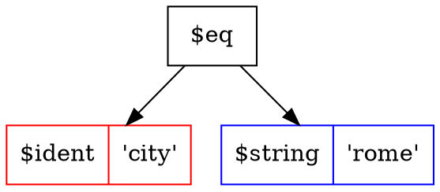

<p align="center">
  
</p>

# Tree Search Language (TSL)

Tree Search Language (TSL) is a wonderful human readable filtering language.

[](https://goreportcard.com/report/github.com/yaacov/tsl)
[](https://travis-ci.org/yaacov/tsl)
[](https://godoc.org/github.com/yaacov/tsl/pkg/tsl)
[](https://opensource.org/licenses/Apache-2.0)

The TSL language grammar is human readable and similar to SQL syntax.

## What I can do with it ?

You can use the TSL package to add uniform and powefull filtering to your RESTful API or GraphQL services, implement brewing-recipe searches on your smart tea brewer, or even make your own memory based SQL server like our `tsl_mem` cli example.

([more examples](/cmd/))

Here is an in-memory search engine, it is using the TSL package to filter through an in-memory array of books using "SQL like" `tsl phrases`:

``` bash
$  ./tsl_mem -i "spec.rating is not null and author ~= 'Joe'" -o prettyjson
```
``` json
[
  {
    "author": "Joe",
    "spec.pages": 100,
    "spec.rating": 4,
    "title": "Book"
  },
  {
    "author": "Joe",
    "spec.pages": 150,
    "spec.rating": 4,
    "title": "Good Book"
  },
  {
    "author": "Joe",
    "spec.pages": 15,
    "spec.rating": 5,
    "title": "My Big Book"
  }
]
```

``` bash
 $  ./tsl_mem -i "spec.rating is null and spec.pages < 250" -o prettyjson
 ```
 ``` json
[
  {
    "author": "Jane",
    "spec.pages": 50,
    "title": "Some Other Book"
  }
]

```

## What does it do ?

The TSL package parses `tsl pharses` into `tsl trees`, it also include extra `walkers` that iterate (walk) over the `tsl tree` to perform exhilarating tasks, for example, convert a `tsl tree` into an SQL expression, create in-memory search engines and BSON object exporters. 

#### Parsing tsl phrases

For example, this `tsl phrase`:
``` sql
name like '%joe%' and (city = 'paris' or city = 'milan')
```

Will be parsed into this `tsl tree`:


## Cool logo

Awesome logo image by [gophers...](https://github.com/egonelbre/gophers).

## Install

#### Building from source using go modules

Building from code requires `go mod`, available on **go v1.11** and above:

``` bash
$ go version
go version go1.11.2 linux/amd64
```

Clone the TSL `git` repository, and run `make`:

```
[ export GO111MODULE=on # if we are on $GOPATH, we need to explicitly set modules on ]
git clone git@github.com:yaacov/tsl.git
cd tsl
make
```

Running `make lint` requires `golangci-lint`:

``` bash
go get -u github.com/golangci/golangci-lint/cmd/golangci-lint
```

Other `make` options include `make lint` for linting check and `make test` for tests.

#### Installing the different packages using `go get`

``` bash
# Install the base package
go get "github.com/yaacov/tsl/pkg/tsl"

# Install all walkers
go get "github.com/yaacov/tsl/pkg/walkers/..."

# Or pick the walker needed
go get "github.com/yaacov/tsl/pkg/walkers/sql"
go get "github.com/yaacov/tsl/pkg/walkers/mongo"
go get "github.com/yaacov/tsl/pkg/walkers/ident"
go get "github.com/yaacov/tsl/pkg/walkers/graphviz"
```

#### Installing the command line examples using `go get`

See CLI tools usage [here](https://github.com/yaacov/tsl#cli-tools).

``` bash
go get -v "github.com/yaacov/tsl/cmd/tsl_parser"
go get -v "github.com/yaacov/tsl/cmd/tsl_mongo"
go get -v "github.com/yaacov/tsl/cmd/tsl_sqlite"
go get -v "github.com/yaacov/tsl/cmd/tsl_gorm"
go get -v "github.com/yaacov/tsl/cmd/tsl_graphql"
```

## Usage

See some code snippets [here](https://github.com/yaacov/tsl#code-examples).

## Complete working demos

For complete working code examples, see the CLI tools code at [/cmd](/cmd).
For CLI tools usage examples see [CLI tools usage](https://github.com/yaacov/tsl#cli-tools).

## TSL syntax examples

#### Operator precedence

This TSL phrase:
``` sql
name like '%joe%' and (city = 'paris' or city = 'milan')
```

Will be parsed into this TSL tree:


#### Operators with multiple arguments

This TSL phrase:
``` sql
name in ('joe', 'jane') and grade not between 0 and 50
```

Will be parsed into this TSL tree:


#### Math operators

This TSL phrase:
``` sql
memory.total - memory.cache > 2000 and cpu.usage > 50
```

Will be parsed into this TSL tree:


#### More math operators

This TSL phrase:
``` sql
(net.rx + net.tx) / 1000 > 3 or net.rx / 1000 > 6
```

Will be parsed into this TSL tree:


Images created using the `tsl_parser` CLI example and Graphviz's `dot` utility:
``` bash
$ ./tsl_parser -i "name like '%joe%' and (city = 'paris' or city = 'milan')" -o dot > file.dot
dot file.dot -Tpng > image.png
```

## Code examples

For complete working code examples, see the CLI tools [direcotry](/cmd)
( see more on TSL's CLI tools usage [here](https://github.com/yaacov/tsl#cli-tools) ).

##### ParseTSL

The `tsl` package include the ParseTSL [code](/pkg/tsl/tsl.go), [doc](https://godoc.org/github.com/yaacov/tsl/pkg/tsl#ParseTSL) method for parsing TSL into a search tree:
``` go
tree, err := tsl.ParseTSL("name in ('joe', 'jane') and grade not between 0 and 50")
```

After parsing the TSL tree will look like this (image created using the `tsl_parser` cli utility using `.dot` output option):


##### sql.Walk

The `walkers` `sql` package include a helper sql.Walk ([code](/pkg/walkers/sql/walk.go), [doc](https://godoc.org/github.com/yaacov/tsl/pkg/walkers/sql#Walk)) method that adds search to [squirrel](https://github.com/Masterminds/squirrel)'s SelectBuilder object:

``` go
import (
    ...
    "github.com/yaacov/tsl/pkg/walkers/sql"
    ...
)

// Parse a TSL phrase into a TSL tree.
tree, err := tsl.ParseTSL("name in ('joe', 'jane') and grade not between 0 and 50")

// Prepare squirrel filter.
filter, err := sql.Walk(tree)

// Create an SQL query.
sql, args, err := sq.Select("name", "city", "state").
    From("users").
    Where(filter).
    ToSql()
```

After SQL generation the `sql` and `args` vars will be:
``` sql
SELECT name, city, state FROM users WHERE (name IN (?,?) AND grade NOT BETWEEN ? AND ?)
```

``` json
["joe", "jane", 0, 50]

```

##### mongo.Walk

The `walkers` `mongo`  package include a helper mongo.Walk ([code](/pkg/walkers/mongo/walk.go), [doc](https://godoc.org/github.com/yaacov/tsl/pkg/walkers/mongo#Walk)) method that adds search bson filter to [mongo-go-driver](https://github.com/mongodb/mongo-go-driver):

``` go
import (
    ...
    "github.com/yaacov/tsl/pkg/walkers/mongo"
    ...
)

// Parse a TSL phrase into a TSL tree.
tree, err := tsl.ParseTSL("name in ('joe', 'jane') and grade not between 0 and 50")

// Prepare a MongoDB BSON document as a filter.
filter, err = mongo.Walk(tree)

// Run query.
cur, err := collection.Find(ctx, filter)
```

##### graphviz.Walk

The `walkers` `graphviz`  package include a helper graphviz.Walk ([code](/pkg/walkers/graphviz/walk.go), [doc](https://godoc.org/github.com/yaacov/tsl/pkg/walkers/graphviz#Walk)) method that exports `.dot` file nodes :

``` go
import (
    ...
    "github.com/yaacov/tsl/pkg/walkers/graphviz"
    ...
)

// Parse a TSL phrase into a TSL tree.
tree, err := tsl.ParseTSL("name in ('joe', 'jane') and grade not between 0 and 50")

// Prepare .dot file nodes as a string.
s, err = graphviz.Walk("", tree, "")

// Wrap the nodes in a digraph wrapper.
s = fmt.Sprintf("digraph {\n%s\n}\n", s)
```

##### ident.Walk

The `walkers` `ident`  package include a helper ident.Walk ([code](/pkg/walkers/ident/walk.go), [doc](https://godoc.org/github.com/yaacov/tsl/pkg/walkers/ident#Walk)) method that checks and mapps identifier names:

``` go
import (
    ...
    "github.com/yaacov/tsl/pkg/walkers/ident"
    ...
)
...

// columnNamesMap mapps between user namespace and the SQL column names.
var columnNamesMap = map[string]string{
	"title":       "title",
	"author":      "author",
	"spec.pages":  "pages",
	"spec.rating": "rating",
}

// checkColumnName checks if a coulumn name is valid in user space replace it
// with the mapped column name and returns and error if not a valid name.
func checkColumnName(s string) (string, error) {
	// Chekc for column name in map.
	if v, ok := columnNamesMap[s]; ok {
		return v, nil
	}

	// If not found return string as is, and an error.
	return s, fmt.Errorf("column \"%s\" not found", s)
}
...

// Parse a TSL phrase into a TSL tree.
tree, err := tsl.ParseTSL("name in ('joe', 'jane') and grade not between 0 and 50")

// Check and replace user identifiers with the SQL table column names.
tree, err = ident.Walk(tree, checkColumnName)
...
```

## Cli tools

The example cli tools showcase the TSL language and `tsl` golang package, see the [cmd](/cmd) directory for code.

##### tls_parser

`tsl_parser` is a basic example, showing how to parse a `tsl phras`e into a `tsl tree`.

``` bash
$ ./tsl_parser -h
Usage of ./tls_parser:
  -i string
    	the tsl string to parse (e.g. "animal = 'kitty'")
  -o string
    	output format [json/yaml/prettyjson/sql/dot] (default "json")
```


``` bash
$ ./tsl_parser -i "(name = 'joe' or name = 'jane') and city = 'rome'" -o sql
```
```
sql:  SELECT * FROM table_name WHERE ((name = ? OR name = ?) AND city = ?)
args: [joe jane rome]
```

``` bash
$ ./tsl_parser -i "(name = 'joe' or name = 'jane') and city = 'rome'" -o prettyjson
```

``` json
{
  "func": "$and",
  "left": {
    "func": "$or",
    "left": {
      "func": "$eq",
      "left": {
        "func": "$ident",
        "left": "name"
      },
      "right": {
        "func": "$string",
        "left": "joe"
      }
    },
    "right": {
      "func": "$eq",
      "left": {
        "func": "$ident",
        "left": "name"
      },
      "right": {
        "func": "$string",
        "left": "jane"
      }
    }
  },
  "right": {
    "func": "$eq",
    "left": {
      "func": "$ident",
      "left": "city"
    },
    "right": {
      "func": "$string",
      "left": "rome"
    }
  }
}
```

``` bash
$ ./tsl_parser -i "city = 'rome'" -o dot
```



##### tsl_mongo

`tsl_mongo` is an example showing `tsl` use with a `mongodb`.


``` bash
$ ./tsl_mongo -h
Usage of ./tsl_mongo:
  -c string
    	collection name to query on (default "books")
  -d string
    	db name to connect to (default "tsl")
  -i string
    	the tsl string to parse (e.g. "author = 'Jane'") (default "title is not null")
  -p	prepare a book collection for queries
  ...
  -u string
    	url for mongo server (default "mongodb://localhost:27017")
```

``` bash
$ ./tsl_mongo -p -i "title is not null" | jq
```
``` json
{
  "title": "Book",
  "author": "Joe",
  "spec": {
    "pages": 100,
    "rating": 4
  }
}
```
``` bash
$ ./tsl_mongo -i "title ~= 'Other' and spec.rating > 1" | jq
```
``` json
{
  "title": "Other Book",
  "author": "Jane",
  "spec": {
    "pages": 200,
    "rating": 3
  }
}
```

##### tsl_sqlite

`tsl_sqlite` is an example showing `tsl` use with `sqlite`.

``` bash
$ ./tsl_sqlite -h
Usage of ./tsl_sqlite:
  -f string
    	the sqlite database file name (default "./sqlite.db")
  -i string
    	the tsl string to parse (e.g. "Title = 'Book'")
  -p	prepare a book collection for queries
```

``` bash
$ SQL="title like '%Book%' and spec.pages > 100"
$ ./tsl_sqlite -i "$SQL" -p | jq
```
``` json
{
  "title": "Other Book",
  "author": "Jane",
  "spec": {
    "pages": 200,
    "rating": 3
  }
}
{
  "title": "Good Book",
  "author": "Joe",
  "spec": {
    "pages": 150,
    "rating": 4
  }
}
```

##### tsl_gorm

`tsl_gorm` is an example showing `tsl` use the `gorm` package.

``` bash
$ ./tsl_gorm -h
Usage of ./tsl_gorm:
  -f string
    	the sqlite database file name (default "./sqlite.db")
  -i string
    	the tsl string to parse (e.g. "title = 'Book'") (default "title is not null")
  -p	prepare a book collection for queries
```

``` bash
$ SQL="title like '%Book%' and spec.pages > 100"
$ ./tsl_gorm -i "$SQL" -p | jq
```
``` json
{
  "title": "Other Book",
  "author": "Jane",
  "spec": {
    "pages": 200,
    "rating": 3
  }
}
{
  "title": "Good Book",
  "author": "Joe",
  "spec": {
    "pages": 150,
    "rating": 4
  }
}
```

##### tsl_mem

`tsl_mem` is an advanced example showing a custom walker, implementing in-memory sql server.

``` bash
 $ ./tsl_mem -i "spec.rating > 4 and title ~= 'Big'" -o yaml
 ```
 ``` yaml
- author: Joe
  spec.pages: 15
  spec.rating: 5
  title: My Big Book
```

##### tsl_graphql

`tsl_graphql` is an example showing a `graphql` serve using `tsl`.

``` bash
$ ./tsl_graphql -h
Usage of ./tsl_graphql:
  -f string
    	the sqlite database file name (default "./sqlite.db")
  -p	prepare a book collection for queries
```

``` bash
$ ./tsl_graphql -p

TSL GraphQL server listen on port: 8080

Query example:
  curl -sG "http://localhost:8080/graphql" --data-urlencode \
	"query={books(filter:\"title like '%Other%' and spec.pages>100\"){title,author,spec{pages}}}"
```

``` bash
$ curl -sG "http://localhost:8080/graphql" --data-urlencode \
     "query={books(filter:\"title like '%Other%' and spec.pages>100\"){title,author,spec{pages}}}" | jq
{
  "data": {
    "books": [
      {
        "author": "Jane",
        "spec": {
          "pages": 200
        },
        "title": "Other Book"
      },
      {
        "author": "Jane",
        "spec": {
          "pages": 250
        },
        "title": "Other Great Book"
      }
    ]
  }
}
```

## Grammar

##### Antlr4 grammar

TSL parser is generated using [Antlr4 tool](https://github.com/antlr/antlr4/), the antlr4 grammar file is [TSL.g4](/TSL.g4).

##### Keywords
```
and or not is null like between in
```
##### Operators
```
= <= >= != ~= ~! <> + - * / %
