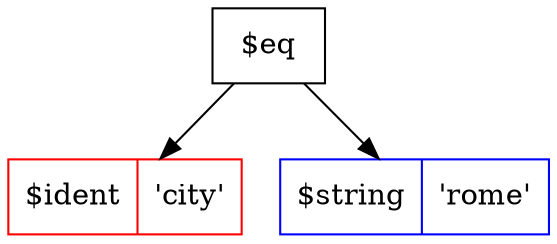

# Tree Search Language (TSL)

Tree Search Language (TSL) is a wonderful search language, With similar grammar to SQL's
where part. implementing query based search engines was never that easy.

[](https://goreportcard.com/report/github.com/yaacov/tsl)
[](https://travis-ci.org/yaacov/tsl)
[](https://godoc.org/github.com/yaacov/tsl/pkg/tsl)
[](https://opensource.org/licenses/Apache-2.0)


[ awesome image by [gophers...](https://github.com/egonelbre/gophers) ]

The TSL language grammar is similar to SQL syntax, for example:
``` sql
name like '%joe%' and (city = 'paris' or city = 'milan')
```


``` sql
name in ('joe', 'jane') and grade not between 0 and 50
```


``` sql
memory.total - memory.cache > 2000 and cpu.usage > 50
```


``` sql
(net.rx + net.tx) / 1000 > 3 or net.rx / 1000 > 6
```


##### Examples

For code examples see the cli tools in the [/cmd](/cmd) direcotry.

##### ParseTSL

The TSL package include the [ParseTSL](https://godoc.org/github.com/yaacov/tsl/pkg/tsl#ParseTSL) method for parsing TSL into a search tree:
``` go
tree, err := tsl.ParseTSL("name in ('joe', 'jane') and grade not between 0 and 50")
```

After parsing the TSL tree will look like this (image created using the `tsl_parser` cli utility using `.dot` output option):


##### SquirrelWalk

The TSL package include a helper [SquirrelWalk](/pkg/tsl/squirrel_walk.go) method that adds search to [squirrel](https://github.com/Masterminds/squirrel)'s SelectBuilder object:

``` go
// Prepare squirrel filter.
filter, err := tsl.SquirrelWalk(tree)

// Create an SQL query.
sql, args, err := sq.Select("name", "city", "state").
    From("users").
    Where(filter).
    ToSql()
```

After SQL generation the `sql` and `args` vars will be:
``` sql
SELECT name, city, state FROM users WHERE (name IN (?,?) AND grade NOT BETWEEN ? AND ?)
```

``` json
["joe", "jane", 0, 50]

```

##### BSONWalk

The TSL package include a helper [BSONWalk](/pkg/tsl/bson_walk.go) method that adds search bson filter to [mongo-go-driver](https://github.com/mongodb/mongo-go-driver):

``` go
// Prepare a bson filter.
filter, err = tsl.BSONWalk(tree)

// Run query.
cur, err := collection.Find(ctx, bson.NewDocument(filter))
```

##### GraphvizWalk

The TSL package include a helper [GraphvizWalk](/pkg/tsl/graphviz_walk.go) method that exports `.dot` file nodes :

``` go
// Prepare .dot file nodes as a string.
s, err = tsl.GraphvizWalk("", tree, "")

// Wrap the nodes in a digraph wrapper.
s = fmt.Sprintf("digraph {\n%s\n}\n", s)
```

## Cli tools

[tls_parser](/cmd/tsl_parser), [tls_mongo](/cmd/tsl_mongo) and [tsl_sqlite](/cmd/tsl_sqlite) are example cli tools showcasing the TSL language and TSL golang package.

##### tls_parser

``` bash
$ ./tsl_parser -h
Usage of ./tls_parser:
  -i string
    	the tsl string to parse (e.g. "animal = 'kitty'")
  -o string
    	output format [json/yaml/prettyjson/sql/dot] (default "json")
```


``` bash
$ ./tsl_parser -i "(name = 'joe' or name = 'jane') and city = 'rome'" -o sql
```
```
sql:  SELECT * FROM table_name WHERE ((name = ? OR name = ?) AND city = ?)
args: [joe jane rome]
```

``` bash
./tsl_parser -i "(name = 'joe' or name = 'jane') and city = 'rome'" -o prettyjson
```

``` json
{
  "func": "$and",
  "left": {
    "func": "$or",
    "left": {
      "func": "$eq",
      "left": {
        "func": "$ident",
        "left": "name"
      },
      "right": {
        "func": "$string",
        "left": "joe"
      }
    },
    "right": {
      "func": "$eq",
      "left": {
        "func": "$ident",
        "left": "name"
      },
      "right": {
        "func": "$string",
        "left": "jane"
      }
    }
  },
  "right": {
    "func": "$eq",
    "left": {
      "func": "$ident",
      "left": "city"
    },
    "right": {
      "func": "$string",
      "left": "rome"
    }
  }
}
```

``` bash
./tsl_parser -i "city = 'rome'" -o dot
```



##### tsl_mongo

tsl_mongo include an example using [BSONWalk](/pkg/tsl/bson_walk.go) method, for building a mongo bson filter.

``` bash
$ ./tsl_mongo -h
Usage of ./tsl_mongo:
  -c string
    	collection name to query on (default "books")
  -d string
    	db name to connect to (default "tsl")
  -i string
    	the tsl string to parse (e.g. "author = 'Jane'") (default "title is not null")
  -p	prepare a book collection for queries
  ...
  -u string
    	url for mongo server (default "mongodb://localhost:27017")
```

``` bash
$ ./tsl_mongo -p -i "title is not null" | jq
```
``` json
{
  "_id": {
    "$oid": "5b8999c0f678c456481f7baf"
  },
  "title": "Book",
  "author": "Joe",
  "spec": {
    "pages": {
      "$numberLong": "100"
    },
    "Rating": {
      "$numberLong": "4"
    }
  }
}

```
``` bash
$ ./tsl_mongo -i "title ~= 'Other' and spec.rating > 1" | jq
```
``` json
{
  "_id": {
    "$oid": "5b899a6c3707c8ba0b00b656"
  },
  "title": "Other Book",
  "author": "Jane",
  "spec": {
    "pages": {
      "$numberLong": "200"
    },
    "Rating": {
      "$numberLong": "3"
    }
  }
}
```

##### tsl_sqlite

``` bash
./tsl_sqlite -h
Usage of ./tsl_sqlite:
  -f string
    	the sqlite database file name (default "./sqlite.db")
  -i string
    	the tsl string to parse (e.g. "Title = 'Book'")
  -p	prepare a book collection for queries
```

``` bash
$ SQL="Title like '%Book%' and Pages > 100"
$ ./tsl_sqlite -i "$SQL" -p
```
```
Creating table.
Insert demo books.
{2 Other Book Jane 200 3}
{5 Good Book Joe 150 4}

```

## Grammar

##### Antlr4 grammar

TSL is generated using [Antlr4 tool](https://github.com/antlr/antlr4/), the antlr4 grammar file is [TSL.g4](/TSL.g4).

##### Keywords
```
and or not is null like between in
```
##### Operators
```
= <= >= != ~= ~! <> + - * / %
```
##### Examples
```
name = 'Joe'
```
```
city in ('paris', 'rome', 'milan') or sate = 'spain'
```
```
(name = 'joe' or city = 'rome') and state = 'italy'
```
```
net.tx + net.rx > 2000 or mem.total - mem.usage < 1000
```

## Code snippets


``` go
import "github.com/yaacov/tsl/pkg/tsl"
```

##### ParseTSL

ParseTSL takes a string input and generate a search tree object, the function
returns the root Node of the tree.

``` go
...
// Set a TSL input string.
input = "name='joe' or name='jane'"

// Parse input string into a TSL tree.
tree, err := tsl.ParseTSL(input)
...
```

##### SquirrelWalk

SquirrelWalk and BSONWalk are example methods the demonstrate traversing ( walk ) the search tree.

SquirrelWalk takes the base Node ( tree ) of the search tree, and return a Squirrel SQL filter object.

``` go
import (
    ...
    sq "github.com/Masterminds/squirrel"
    "github.com/yaacov/tsl/pkg/tsl"
    ...
)
...
// Set filter.
filter, err := tsl.SquirrelWalk(tree)

// Convert TSL tree into SQL string using squirrel select builder.
sql, args, err := sq.Select("name, city, state").
    From("users").
    Where(filter).
    ToSql()
...
```

##### BSONWalk

BSONWalk takes the base Node ( tree ) of the search tree, and return a MongoDB BSON object.

``` go
...
// Prepare a bson filter.
filter, err = tsl.BSONWalk(tree)

// Run query.
cur, err := collection.Find(ctx, bson.NewDocument(filter))
defer cur.Close(ctx)

// Loop on query elements.
for cur.Next(ctx) {
    ...
```
