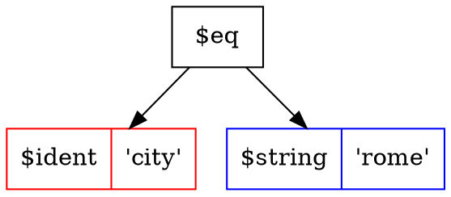

<p align="center">
  
</p>

# Tree Search Language (TSL) Command Line Interface (CLI) Examples

[tls_parser](/cmd/tsl_parser), [tls_mongo](/cmd/tsl_mongo) and [tsl_sqlite](/cmd/tsl_sqlite) are example cli tools showcasing the TSL language and TSL golang package.

##### tls_parser

``` bash
$ ./tsl_parser -h
Usage of ./tls_parser:
  -i string
    	the tsl string to parse (e.g. "animal = 'kitty'")
  -o string
    	output format [json/yaml/prettyjson/sql/dot] (default "json")
```


``` bash
$ ./tsl_parser -i "(name = 'joe' or name = 'jane') and city = 'rome'" -o sql
```
```
sql:  SELECT * FROM table_name WHERE ((name = ? OR name = ?) AND city = ?)
args: [joe jane rome]
```

``` bash
./tsl_parser -i "(name = 'joe' or name = 'jane') and city = 'rome'" -o prettyjson
```

``` json
{
  "func": "$and",
  "left": {
    "func": "$or",
    "left": {
      "func": "$eq",
      "left": {
        "func": "$ident",
        "left": "name"
      },
      "right": {
        "func": "$string",
        "left": "joe"
      }
    },
    "right": {
      "func": "$eq",
      "left": {
        "func": "$ident",
        "left": "name"
      },
      "right": {
        "func": "$string",
        "left": "jane"
      }
    }
  },
  "right": {
    "func": "$eq",
    "left": {
      "func": "$ident",
      "left": "city"
    },
    "right": {
      "func": "$string",
      "left": "rome"
    }
  }
}
```

``` bash
./tsl_parser -i "city = 'rome'" -o dot
```



##### tsl_mongo

``` bash
$ ./tsl_mongo -h
Usage of ./tsl_mongo:
  -c string
    	collection name to query on (default "books")
  -d string
    	db name to connect to (default "tsl")
  -i string
    	the tsl string to parse (e.g. "author = 'Jane'") (default "title is not null")
  -p	prepare a book collection for queries
  ...
  -u string
    	url for mongo server (default "mongodb://localhost:27017")
```

``` bash
$ ./tsl_mongo -p -i "title is not null" | jq
```
``` json
{
  "title": "Book",
  "author": "Joe",
  "spec": {
    "pages": 100,
    "rating": 4
  }
}
```
``` bash
$ ./tsl_mongo -i "title ~= 'Other' and spec.rating > 1" | jq
```
``` json
{
  "title": "Other Book",
  "author": "Jane",
  "spec": {
    "pages": 200,
    "rating": 3
  }
}
```

##### tsl_sqlite

``` bash
./tsl_sqlite -h
Usage of ./tsl_sqlite:
  -f string
    	the sqlite database file name (default "./sqlite.db")
  -i string
    	the tsl string to parse (e.g. "Title = 'Book'")
  -p	prepare a book collection for queries
```

``` bash
$ SQL="title like '%Book%' and spec.pages > 100"
$ ./tsl_sqlite -i "$SQL" -p | jq
```
``` json
{
  "title": "Other Book",
  "author": "Jane",
  "spec": {
    "pages": 200,
    "rating": 3
  }
}
{
  "title": "Good Book",
  "author": "Joe",
  "spec": {
    "pages": 150,
    "rating": 4
  }
}
```
