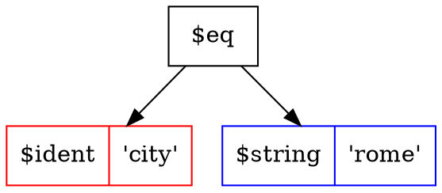

<p align="center">
  
</p>

# Tree Search Language (TSL)

Tree Search Language (TSL) is a wonderful human readable filtering language.

[](https://goreportcard.com/report/github.com/yaacov/tree-search-language/v6)
[](https://pkg.go.dev/github.com/yaacov/tree-search-language/v6/pkg/tsl?tab=doc)
[](https://opensource.org/licenses/Apache-2.0)

The TSL language grammar is human readable and similar to SQL syntax.

## Awesome:

-  [What I can do with it ?](#what-i-can-do-with-it-)
-  [What does it do ?](#what-does-it-do-)
-  [Cool logo](#cool-logo)
-  [Install](#install)
-  [Syntax examples](#syntax-examples)
-  [Types](#types)
-  [Code examples](#code-examples)
-  [CLI tools](#cli-tools)
-  [Grammar](#grammar)

## What I can do with it ?

You can use the TSL package to add uniform and powerful filtering to your RESTful API or GraphQL services, implement brewing-recipe searches on your smart tea brewer, or even make your own memory based "SQL like" server as we do in our `tsl_mem` CLI example.

([more examples](/v6/cmd/))

[kubestl-sql](https://github.com/yaacov/kubectl-sql) uses TSL to select Kubernetes resources based on the value of one or more resource fields.

Here is our `tsl_mem`CLI tool ([code](/v6/cmd/tsl_mem)), it's an in-memory search engine, it is using the TSL package to filter through an in-memory array of books using "SQL like" `tsl phrases`:

``` bash
$  ./tsl_mem -i "rating is not null and author ~= 'Joe'" | jq
```
``` json
[
  {
    "author": "Joe",
    "spec.pages": 100,
    "spec.rating": 4,
    "title": "Book"
  },
  {
    "author": "Joe",
    "spec.pages": 150,
    "spec.rating": 4,
    "title": "Good Book"
  },
  {
    "author": "Joe",
    "spec.pages": 15,
    "spec.rating": 5,
    "title": "My Big Book"
  }
]
```

``` bash
 $  ./tsl_mem -i "rating is null and pages < 250" | jq
 ```
 ``` json
[
  {
    "author": "Jane",
    "spec.pages": 50,
    "title": "Some Other Book"
  }
]

```

## What does it do ?

The TSL package parses `tsl phrases` into `tsl trees`, it also include extra `walkers` that iterate (walk) over the `tsl tree` to perform exhilarating tasks, for example, convert a `tsl tree` into an SQL expression, create in-memory search engines, BSON object exporters and even more exciting stuff. 

#### Parsing tsl phrases

For example, this `tsl phrase`:

``` sql
name like '%joe%' and (city = 'paris' or city = 'milan')
```

Will be parsed into this `tsl tree`:


## Cool logo

Awesome logo image by [gophers...](https://github.com/egonelbre/gophers).

## Install

#### Building from source using go modules

``` bash
$ go version
go version go1.23.4 linux/amd64
```

Clone the TSL `git` repository, and run `make`:

``` bash
git clone git@github.com:yaacov/tree-search-language.git
cd tree-search-language/v6
make
```

Other `make` options include `make lint` for linting check and `make test` for tests.

#### Installing the different packages using `go get`

``` bash
# Install the base package
go get "github.com/yaacov/tree-search-language/v6/pkg/tsl"

# Install all walkers
go get "github.com/yaacov/tree-search-language/v6/pkg/walkers/..."

# Or pick the walker needed
go get "github.com/yaacov/tree-search-language/v6/pkg/walkers/sql"
go get "github.com/yaacov/tree-search-language/v6/pkg/walkers/semantics"
go get "github.com/yaacov/tree-search-language/v6/pkg/walkers/ident"
go get "github.com/yaacov/tree-search-language/v6/pkg/walkers/graphviz"
```

#### Installing the command line example using `go install`

See CLI tools usage [here](https://github.com/yaacov/tree-search-language#cli-tools).

``` bash
go install -v "github.com/yaacov/tree-search-language/v6/cmd/tsl_parser"
```

## Syntax examples

#### Operator precedence

This TSL phrase:

``` sql
name like '%joe%' and (city = 'paris' or city = 'milan')
```

Will be parsed into this TSL tree:


#### Operators with multiple arguments

This TSL phrase:

``` sql
name in ('joe', 'jane') and grade not between 0 and 50
```

Will be parsed into this TSL tree:


#### Math operators

This TSL phrase:

``` sql
memory.total - memory.cache > 2000 and cpu.usage > 50
```

Will be parsed into this TSL tree:


#### More math operators

This TSL phrase:

``` sql
(net.rx + net.tx) / 1000 > 3 or net.rx / 1000 > 6
```

Will be parsed into this TSL tree:


#### SI units

This TSL phrase:

``` sql
(net.rx + net.tx) < 1Ki
```

Will be parsed into this TSL tree:


Images created using the `tsl_parser` CLI example and Graphviz's `dot` utility:
``` bash
$ ./tsl_parser -i "name like '%joe%' and (city = 'paris' or city = 'milan')" -o dot > file.dot
dot file.dot -Tpng > image.png
```

## Types

#### Booleans

```  sql
supported = true
```

Will be parsed into this TSL tree:


#### Dates (RFC3339)

```  sql
date = 2020-01-01T20:00:00Z
```

Will be parsed into this TSL tree:


## Code examples

For complete working code examples, see the CLI tools [directory](/v6/cmd)
( see more on TSL's CLI tools usage [here](https://github.com/yaacov/tree-search-language#cli-tools) ).

##### ParseTSL

The `tsl` package include the ParseTSL [code](/v6/pkg/tsl/tsl.go), [doc](https://pkg.go.dev/github.com/yaacov/tree-search-language/v6/pkg/tsl#ParseTSL) method for parsing TSL into a search tree:
``` go
tree, err := tsl.ParseTSL("name in ('joe', 'jane') and grade not between 0 and 50")
if err != nil {
    log.Fatal(err)
}
defer tree.Free()
```

After parsing the TSL tree will look like this (image created using the `tsl_parser` cli utility using `.dot` output option):


##### sql.Walk

The `walkers` `sql` package include a helper sql.Walk ([code](/v6/pkg/walkers/sql/walk.go), [doc](https://pkg.go.dev/github.com/yaacov/tree-search-language/v6/pkg/walkers/sql#Walk)) method that adds search to [squirrel](https://github.com/Masterminds/squirrel)'s SelectBuilder object:

``` go
import (
    ...
    sq "github.com/Masterminds/squirrel"
    "github.com/yaacov/tree-search-language/v6/pkg/walkers/sql"
    ...
)

// Parse a TSL phrase into a TSL tree.
tree, err := tsl.ParseTSL("name in ('joe', 'jane') and grade not between 0 and 50")
if err != nil {
    log.Fatal(err)
}
defer tree.Free()

// Prepare squirrel filter.
filter, err := sql.Walk(tree)
if err != nil {
    log.Fatal(err)
}

// Create an SQL query.
sql, args, err := sq.Select("name", "city", "state").
    From("users").
    Where(filter).
    ToSql()
if err != nil {
    log.Fatal(err)
}
```

After SQL generation the `sql` and `args` vars will be:
``` sql
SELECT name, city, state FROM users WHERE (name IN (?,?) AND grade NOT BETWEEN ? AND ?)
```

``` json
["joe", "jane", 0, 50]

```

##### graphviz.Walk

The `walkers` `graphviz`  package include a helper graphviz.Walk ([code](/v6/pkg/walkers/graphviz/walk.go), [doc](https://pkg.go.dev/github.com/yaacov/tree-search-language/v6/pkg/walkers/graphviz#Walk)) method that exports `.dot` file nodes :

``` go
import (
    ...
    "github.com/yaacov/tree-search-language/v6/pkg/walkers/graphviz"
    ...
)

// Parse a TSL phrase into a TSL tree.
tree, err := tsl.ParseTSL("name in ('joe', 'jane') and grade not between 0 and 50")
if err != nil {
    log.Fatal(err)
}
defer tree.Free()

// Prepare .dot file nodes as a string.
s, err = graphviz.Walk("", tree, "")
if err != nil {
    log.Fatal(err)
}

// Wrap the nodes in a digraph wrapper.
s = fmt.Sprintf("digraph {\n%s\n}\n", s)
```

##### ident.Walk

The `walkers` `ident`  package include a helper ident.Walk ([code](/v6/pkg/walkers/ident/walk.go), [doc](https://pkg.go.dev/github.com/yaacov/tree-search-language/v6/pkg/walkers/ident#Walk)) method that checks and mapps identifier names:

``` go
import (
    ...
    "github.com/yaacov/tree-search-language/v6/pkg/walkers/ident"
    ...
)
...

// columnNamesMap mapps between user namespace and the SQL column names.
var columnNamesMap = map[string]string{
	"title":       "title",
	"author":      "author",
	"spec.pages":  "pages",
	"spec.rating": "rating",
}

// checkColumnName checks if a column name is valid in user space replace it
// with the mapped column name and returns and error if not a valid name.
func checkColumnName(s string) (string, error) {
	// Check for column name in map.
	if v, ok := columnNamesMap[s]; ok {
		return v, nil
	}

	// If not found return string as is, and an error.
	return s, fmt.Errorf("column \"%s\" not found", s)
}
...

// Parse a TSL phrase into a TSL tree.
tree, err := tsl.ParseTSL("name in ('joe', 'jane') and grade not between 0 and 50")
if err != nil {
    log.Fatal(err)
}
defer tree.Free()

// Check and replace user identifiers with the SQL table column names.
newTree, err = ident.Walk(tree, checkColumnName)
if err != nil {
    log.Fatal(err)
}
defer newTree.Free() // mewTree is a clone that needs freeing.
...
```

##### semantics.Walk

The `walkers` `semantics`  package include a helper semantics.Walk ([code](/v6/pkg/walkers/semantics/walk.go), [doc](https://pkg.go.dev/github.com/yaacov/tree-search-language/v6/pkg/walkers/semantics#Walk)) method that helps filter a list of objects using a `tsl tree`, and a `type` `semantics.EvalFunc` ([code](/v6/pkg/walkers/semantics/walk.go), [doc](https://pkg.go.dev/github.com/yaacov/tree-search-language/v6/pkg/walkers/semantics#EvalFunc)) that return a record's value for a record key:

``` go
import (
    ...
    "github.com/yaacov/tree-search-language/v6/pkg/walkers/semantics"
    ...
)
...

// evalFactory creates an evaluation function for a data record.
//
// Returns:
// A function that gets a `key` for a record and returns the value.
// If no value can be found for this `key` in our record, it will return
// ok = false, if value is found it will return ok = true.
func evalFactory(book Book) semantics.EvalFunc {
	return func(k string) (interface{}, bool) {
		if v, ok := book[k]; ok {
			return v, true
		}
		return nil, false
	}
}

// Check if a record complies with our tsl tree.
record := map[string]string{
    "title":       "A good book",
    "author":      "Joe",
    "spec.pages":  14,
    "spec.rating": 5.0,
}
eval := evalFactory(record)
compliance, err := semantics.Walk(tree, eval)
if err != nil {
    log.Fatal(err)
}
```

## CLI tools

The example CLI tools showcase the TSL language and `tsl` golang package, see the [cmd](/v6/cmd) directory for code.

##### tsl_parser

`tsl_parser` is a basic example, showing how to parse a `tsl phrase` into a `tsl tree`.

``` bash
$ ./tsl_parser -h
Usage of ./tsl_parser:
  -i string
    	the tsl string to parse (e.g. "animal = 'kitty'")
  -o string
    	output format [json/yaml/sql/dot] (default "json")
```


``` bash
$ ./tsl_parser -i "(name = 'joe' or name = 'jane') and city = 'rome'" -o sql
```
```
sql:  SELECT * FROM table_name WHERE ((name = ? OR name = ?) AND city = ?)
args: [joe jane rome]
```

``` bash
$ ./tsl_parser -i "(name = 'joe' or name = 'jane') and city = 'rome'" | jq
```

``` json
{
  "type": "BINARY_EXP",
  "operator": "AND",
  "left": {
    "type": "BINARY_EXP",
    "operator": "OR",
    "left": {
      "type": "BINARY_EXP",
      "operator": "EQ",
      "left": {
        "type": "IDENTIFIER",
        "value": "name"
      },
      "right": {
        "type": "STRING",
        "value": "joe"
      }
    },
    "right": {
      "type": "BINARY_EXP",
      "operator": "EQ",
      "left": {
        "type": "IDENTIFIER",
        "value": "name"
      },
      "right": {
        "type": "STRING",
        "value": "jane"
      }
    }
  },
  "right": {
    "type": "BINARY_EXP",
    "operator": "EQ",
    "left": {
      "type": "IDENTIFIER",
      "value": "city"
    },
    "right": {
      "type": "STRING",
      "value": "rome"
    }
  }
}
```

``` bash
$ ./tsl_parser -i "city = 'rome'" -o dot
```



Convert the .dot file into a PNG image using Graphviz's dot utility:

``` bash
# Convert .dot file to PNG
$ dot -Tpng file.dot -o tree.png
```

##### tsl_mem

`tsl_mem` is an advanced example showing a custom walker, implementing in-memory sql server.

``` bash
 $ ./tsl_mem -i "rating > 4 and title ~= 'Big'" -o yaml
 ```
 ``` yaml
- author: Joe
  spec.pages: 15
  spec.rating: 5
  title: My Big Book
```

## Grammar

##### Flex and Bison grammar

TSL parser is generated using [Flex](https://github.com/westes/flex) and [Bison](https://www.gnu.org/software/bison/), the grammar files are:
- [tsl_lexer.l](/v6/pkg/parser/tsl_lexer.l) - Lexical analyzer (Flex)
- [tsl_parser.y](/v6/pkg/parser/tsl_parser.y) - Grammar parser (Bison)

##### Keywords
```
and or not is null like ilike between in
```
##### Operators
```
= <= >= != ~= ~! <> + - * / %
```

##### Special Literals
```
Date (YYYY-MM-DD)
RFC3339 datetime
Numbers with SI unit suffixes (Ki, Mi, Gi, Ti, Pi or K, M, G, T, P)
String literals (quoted with ', " or `)
Identifiers (including dots)
Boolean literals (true/false)
Null
```